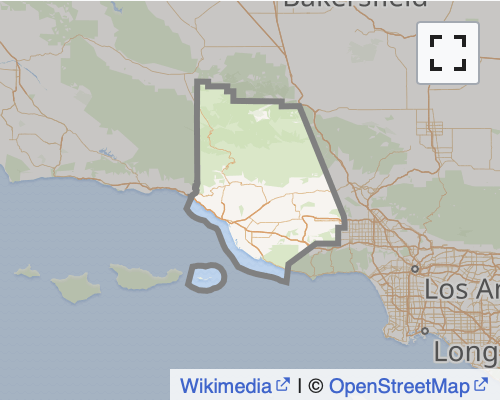
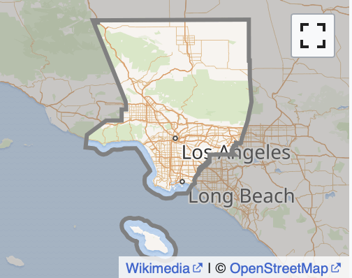

# Zillow Data: Predicting Tax Value of Single Family Homes
This is the repo for a regression analysis project using a Zillow data set to assess drivers for tax value of single family homes and also create a predictive ML model for prices.

**Goal:** To use the finished square footage, number of bedrooms and number of bathrooms to estimate the assessed tax value of single family homes that had a transaction in 2017.

**Plan of Attack:**

1. Get background information on the properties in the dataset to include a data dictionary.
2. Use information gleaned to build a MySQL query that efficiently retrieves only the necessary data and import it into a Pandas DataFrame.
3. Wrangle data as necessary to clean, tidy, and split into Train, Validation, and Test datasets for EDA.
4. Apply pre-processing steps such as scaling and encoding to prepare for modeling.
5. Model the data using appropriate regression techniques to predict the continuous target variable.
6. Evaluate metrics from various models and choose a recommended best model.
7. Prepare report of findings
8. Prepare a tidy repo of all instructions and files needed to explain and repeat processes.

### Intro: Background Information

There are three FIPS codes in the dataset. These are Federal Information Processing Codes which are created by the federal government and ANSI to designate specific locations in a standardized way. In this case they are codes for counties in California where all of the properties in the dataset are located. Here they are described in order from Northwest to Southeast:

#### **Counties in the Dataset:**

##### **Ventura County: FIPS 6111**

Ventura County (/vɛnˈtʊərə/ (listen)) is a county in the southern part of the U.S. state of California. As of the 2020 census, the population was 843,843.[9][11] The largest city is Oxnard, and the county seat is the city of Ventura.[12]

Ventura County comprises the Oxnard–Thousand Oaks–Ventura, CA Metropolitan Statistical Area, which is part of the Greater Los Angeles area (Los Angeles-Long Beach, CA Combined Statistical Area). It is also considered the southernmost county along the California Central Coast.[13]

Two of the Channel Islands are part of the county: Anacapa Island, which is the most visited island in Channel Islands National Park,[14] and San Nicolas Island.
- Wikipedia, *Ventura County, California*

##### **Los Angeles County FIPS 6037**

Los Angeles County, officially the County of Los Angeles (Spanish: Condado de Los Ángeles),[7] and sometimes abbreviated as L.A. County, is the most populous county in the United States, with 9,861,224 residents estimated in 2022.[1] Its population is greater than that of 40 individual U.S. states. Comprising 88 incorporated cities and many unincorporated areas within a total area of 4,083 square miles (10,570 km2), it is home to more than a quarter of Californians and is one of the most ethnically diverse U.S. counties.[8] The county's seat, Los Angeles, is the second most populous city in the United States, with about 3.9 million residents.
- Wikipedia, *Los Angeles County, California*

##### **Orange County: FIPS 6059**

Orange County, often known by its initials O.C., is located in the Los Angeles metropolitan area in Southern California. As of the 2020 census, the population was 3,186,989,[4] making it the third-most-populous county in California, the sixth-most-populous in the United States, and more populous than 19 American states and Washington, D.C.[6] Although largely suburban, it is the second-most-densely-populated county in the state behind San Francisco County.[7] The county's three most-populous cities are Anaheim, Santa Ana, and Irvine, each of which has a population exceeding 300,000.[8] Santa Ana is also the county seat. Six cities in Orange County are on the Pacific coast: Seal Beach, Huntington Beach, Newport Beach, Laguna Beach, Dana Point, and San Clemente. Orange County is included in the Los Angeles-Long Beach-Anaheim Metropolitan Statistical Area. The county has 34 incorporated cities.  
- Wikipedia, *Orange County, California*

#### California Property Tax Information
Since we are creating a model of assessed tax value for properties in three California counties, it is useful to have some background on how those values are assessed and levied.

The California Legislative Affairs Office (CLAO) website describes the basics of property taxation in California:
https://lao.ca.gov/reports/2012/tax/property-tax-primer-112912.aspx
> "A Property Tax Bill Includes a Variety of Different Taxes and Charges. A typical California property tax bill consists of many taxes and charges including the 1 percent rate, voter–approved debt rates, parcel taxes, Mello–Roos taxes, and assessments. This report focuses primarily on the 1 percent rate, which is the largest tax on the property tax bill and the only rate that applies uniformly across every locality. The taxes due from the 1 percent rate and voter–approved debt rates are based on a property’s assessed value. The California Constitution sets the process for determining a property’s taxable value. Although there are some exceptions, a property’s assessed value typically is equal to its purchase price adjusted upward each year by 2 percent. Under the Constitution, other taxes and charges may not be based on the property’s value."

> "newer property owners often pay a higher effective tax rate than people who have owned their homes or businesses for a long time." (due to property values growing faster than the two percent mechanism)

For the sample bill above, Section A shows the assessed value of the property, Section B the taxes based on a percentage of taxable value, and section C the taxes levied without regard to the assessed value. The General Tax Levy is state mandated and applies to all properties (there are some exemptions, but they apply to governments, non-profits, religious institutions and seem irrelavent to this project). Each property will likely belong to one or more special districts whose boundaries do not necessarily correspond to the fips code or county that the property is in. This makes prediction of these elements somewhat difficult without mapping all of the properties into their respective special districts. However, there is some general guidance as to the ratio between the General Levy and the average of the other taxes in the CLAO report:

> Local governments collected about 43 billion dollars in 2010–11 from the 1 percent rate. The other taxes and charges on the property tax bill generated an additional 12 billion dollars.

This amount to a split of about 21.8% of tax bill outside of the general levy and 78.2% from the general levy.
Key Takeaways:
1. The *process* for determining property value is mandated by state Constitution
2. It applies universally to every locality in the state.
3. The formula for determining taxable value is *purchase price + 2% per year*
4. The state tax rate is 1%.
5. There can be locality specific taxes as well. 

##### **Data Dictionary:**

area -  Calculated total finished living area of the home in square feet.

assess_year - The year of the property tax assessment. 

bedrooms -  Number of bedrooms in home.

bathrooms -  Number of bathrooms in home including fractional bathrooms.

fips - Federal Information Processing Standard code -  see https://en.wikipedia.org/wiki/FIPS_county_code for more details

tax_amount - The total property tax assessed for that assessment year.

tax_value - The total tax assessed value of the parcel in U.S Dollars. This is the target variable.

year_built - The Year the principal residence was built. 

zip - Zip code in which the property is located.

### 1. Initial Questions

What are the generally accepted rules governing real estate prices?

    - location, location, location:
        - schools
        - neighborhood
        - busy street v quiet neighborhood
        - proximity to amenities
        - lot size/shape
        - zoning
    - curb appeal
        - architectural style may be useful if one style is trending
    - home features
        - pool
        - A/C
        - fireplace
        - garage
        - general condition
        
What are the proxies for these things in the dataset?

    - proxies for location
        - county (fips) may play a small role, but it seems way too coarse a measure of location.
        - ZIP code would be much more useful
        - Property tax rates may function as signatures for school districts and neighborhoods because in California there are lots of very local special districts. When looking at tax rates for Property taxes in Ventura County, I found there were 2,493 tax areas in 2017. Many of them had different tax rates associated with area of city and school district.
        - Property tax rates coupled with ZIP code could provide a pretty good fingerprint of neighborhood
    - proxies for curb appeal
        - architectural style
        - overall condition of home

### 2. Data Acquisition and Preparation

### 3. Exploratory Data Analysis
 **Univariate Analysis**
 
     - For single-family homes with a transaction in 2017:

    1. average home was built in 1962
    2. had 3.22 bedrooms
    3. had 2.12 bathrooms
    4. was 1725 square feet
    5. with a mean tax value of \$381,625
    6. and a mean tax amount of \$4,729

    - bedrooms, bathrooms, and year built are relatively normally distributed
    - finished area is slightly right skewed
    - tax value and tax are both right skewed with a strong peak near the lower boundary
    
**Bivariate Analysis**

1. There is a high degree of confidence that there is a linear relationship between:
    a. number of bathrooms and tax value
    b. number of bedrooms and tax value
    c. finished square feet of area and tax value
2. There is a high degree of confidence that there is a corellation between fips code and tax value for all three fips in the dataset.
    
    
### 4. Pre-processing

### 5. Modeling

### 6. Model Evaluation

### 7. Conclusions

### 8. Next Steps

-The Tax Values of the properties seem very low to me for the counties and years under consideration. I will add this to the things to look into in the future.

### Appendix: Instructions to Reproduce Work